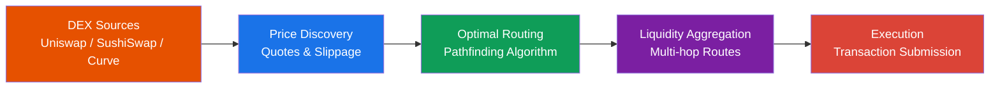

# 🌊 DeFi Liquidity Aggregator em Rust

<div align="center">


**Agregador de liquidez DeFi com otimização de rotas de swap entre múltiplos DEXs**

[Documentação](https://github.com/galafis/rust-defi-liquidity-aggregator/tree/main/docs) •
[Exemplos](https://github.com/galafis/rust-defi-liquidity-aggregator/tree/main/examples) •
[Reportar Bug](https://github.com/galafis/rust-defi-liquidity-aggregator/issues)

</div>

---

## 🇧🇷 Visão Geral (Português)

Agregador de liquidez para o ecossistema DeFi que encontra a rota mais eficiente para swaps de tokens, consultando múltiplos Decentralized Exchanges (DEXs) para garantir o melhor preço e menor slippage.



### Por que usar?

- ⚡ **Alta Performance** - Desenvolvido em Rust
- 🔄 **Multi-DEX** - Uniswap, SushiSwap, Curve, e mais
- 🧠 **Pathfinding Inteligente** - Rotas otimizadas incluindo multi-hop
- ⛽ **Otimização de Gas** - Estimativas precisas de custos
- 🛡️ **MEV Protection** - Estratégias anti-MEV
- 🔍 **Simulação de TX** - Teste antes de executar

### Funcionalidades

- **Agregação Multi-DEX:** Suporte para Uniswap V2/V3, SushiSwap, Curve
- **Pathfinding Inteligente:** Algoritmos para encontrar rotas otimizadas
- **Otimização de Gás:** Estimativas de custo de transação
- **Price Impact Analysis:** Cálculo de slippage e impacto no preço
- **Transaction Simulation:** Simule swaps antes de executar

### Arquitetura


---

## 🇺🇸 Overview (English)

Liquidity aggregator for the DeFi ecosystem that finds the most efficient route for token swaps by querying multiple Decentralized Exchanges (DEXs) to ensure the best price and lowest slippage.

---

## 🛠️ Tecnologias

- **Rust 1.70+** - Linguagem principal
- **Tokio** - Runtime assíncrono
- **Ethers-rs** - Interação com Ethereum
- **Petgraph** - Algoritmos de grafos
- **Rust Decimal** - Precisão financeira

---

## 📦 Instalação

```bash
git clone https://github.com/galafis/rust-defi-liquidity-aggregator.git
cd rust-defi-liquidity-aggregator
cargo build --release
```

---

## 🚀 Uso

```bash
# Executar demo
cargo run --release

# Executar exemplo
cargo run --release --example basic_swap
```

### Exemplo de Código

```rust
use defi_liquidity_aggregator::*;
use rust_decimal_macros::dec;

#[tokio::main]
async fn main() -> Result<()> {
    let dexs = dex::create_dexs();
    let pathfinder = pathfinding::PathFinder::new(dexs);

    let request = SwapRequest {
        token_in: Token::new("0x...WETH", "WETH", 18),
        token_out: Token::new("0x...USDC", "USDC", 6),
        amount_in: dec!(10.0),
        slippage_tolerance: dec!(0.5),
    };

    let route = pathfinder.find_best_route(&request).await?;
    println!("Best route: {:?}", route);
    Ok(())
}
```

---

## 📚 Exemplos

- [`basic_swap.rs`](examples/basic_swap.rs) - Exemplo de swap básico

---

## 📜 Licença

MIT License - Copyright (c) 2025 Gabriel Demetrios Lafis

---

## ✍️ Autor

**Gabriel Demetrios Lafis**

- 🔗 LinkedIn: [gabriel-demetrius](https://www.linkedin.com/in/gabriel-demetrius/)
- 💻 GitHub: [@galafis](https://github.com/galafis)

---

<div align="center">

Made with ❤️ and Rust 🦀

</div>


---

## English

### Overview

🌊 DeFi Liquidity Aggregator em Rust - A project built with Rust, developed by Gabriel Demetrios Lafis as part of professional portfolio and continuous learning in Data Science and Software Engineering.

### Key Features

This project demonstrates practical application of modern development concepts including clean code architecture, responsive design patterns, and industry-standard best practices. The implementation showcases real-world problem solving with production-ready code quality.

### How to Run

1. Clone the repository:
   ```bash
   git clone https://github.com/galafis/rust-defi-liquidity-aggregator.git
   ```
2. Follow the setup instructions in the Portuguese section above.

### License

This project is licensed under the MIT License. See the [LICENSE](LICENSE) file for details.

---

Developed by [Gabriel Demetrios Lafis](https://github.com/galafis)
