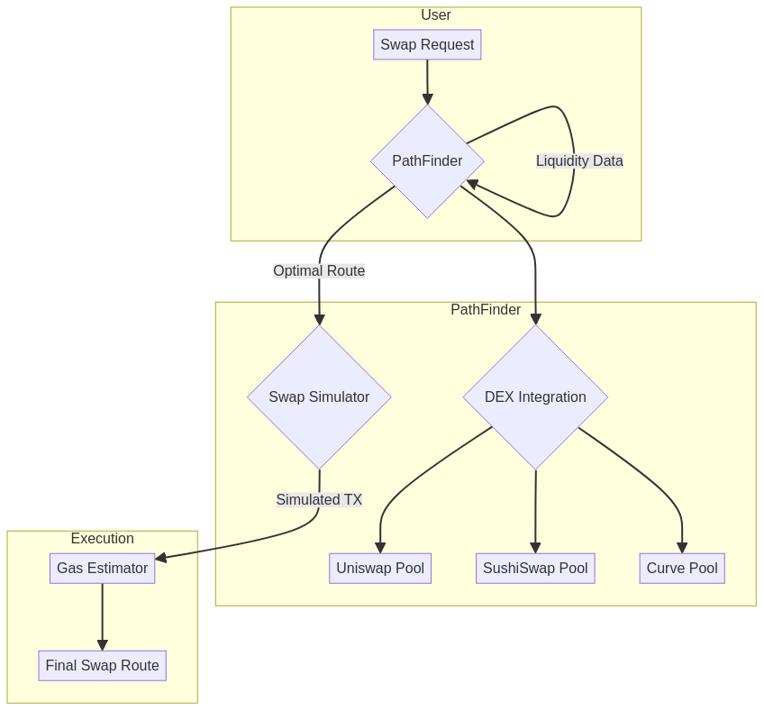

# DeFi Liquidity Aggregator em Rust

  

---

## 🇧🇷 Visão Geral (Português)

Este é um agregador de liquidez para o ecossistema de Finanças Descentralizadas (DeFi), construído em Rust. O projeto visa encontrar a rota mais eficiente para swaps de tokens, consultando múltiplos Decentralized Exchanges (DEXs) para garantir o melhor preço e o menor slippage.

### Funcionalidades
- **Agregação Multi-DEX:** Suporte para Uniswap, SushiSwap, Curve, e outros.
- **Pathfinding Inteligente:** Algoritmos para encontrar a rota de swap mais otimizada, incluindo rotas com múltiplos saltos.
- **Otimização de Gás:** Estimativas de custo de transação para ajudar na tomada de decisão.

### Arquitetura


---

## 🇺🇸 Overview (English)

This is a liquidity aggregator for the Decentralized Finance (DeFi) ecosystem, built in Rust. The project aims to find the most efficient route for token swaps by querying multiple Decentralized Exchanges (DEXs) to ensure the best price and lowest slippage.

### Features
- **Multi-DEX Aggregation:** Support for Uniswap, SushiSwap, Curve, and more.
- **Intelligent Pathfinding:** Algorithms to find the most optimized swap route, including multi-hop routes.
- **Gas Optimization:** Transaction cost estimates to aid in decision-making.

### Architecture


---

## 🚀 Getting Started

```sh
git clone https://github.com/GabrielDemetrius/rust-defi-liquidity-aggregator.git
cd rust-defi-liquidity-aggregator
cargo build --release
cargo run --release
```

## 📜 Licença (License)

MIT License - Copyright (c) 2025 Gabriel Demetrios Lafis
